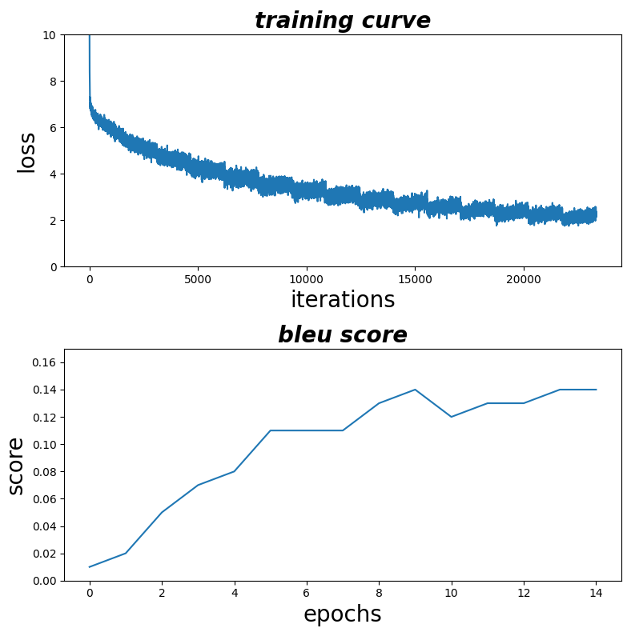

## Start training
training from scratch 
(it will take about 30 min to train 15 epochs on a RTX3060 GPU)
```sh
python train.py --num_epochs=15
```
training from ckpt
```sh
python train.py  --load_model=True --ckpt_file="checkpoint_epoch3.pth.tar" --num_epochs=9
```

## Code structure
download_data.py: download lauguage pair dataset wmt19  
preprocessing.py: tokenize the sentences into words(using spacy and torchtext)  
model.py: implement the [Transformer algorithm](https://arxiv.org/abs/1706.03762) (encoder decoder)  
train.py: main program


## python package requirements
```sh
pip install torchtext==0.14.0
pip install spacy==3.4.4
python -m spacy download zh_core_web_sm
python -m spacy download en-core-web-sm 
#https://pytorch.org/tutorials/beginner/torchtext_translation_tutorial.html
#https://spacy.io/models/zh
```

## datasets 
zh-en dataset is downloaded from [wmt19](https://www.statmt.org/wmt19/translation-task.html).   
[This folder](https://data.statmt.org/news-commentary/v14/training/) has a tons of different languages pair that can be used for Machine translation training.    
In download_data.py, we'll download [	news-commentary-v14.en-zh.tsv.gz](https://data.statmt.org/news-commentary/v14/training/news-commentary-v14.en-zh.tsv.gz) in that folder.  

## training results


## example sentence
src_EN 
```
The bad news is that there has been almost no progress in terms of ensuring that large financial firms actually can go bankrupt
```
target_ZH 

epoch0  ['打碎', '社区', '演绎', '禽流感', '过慢', '名义', '美军', '开始', '核恐怖主义', '毫无例外', '王权', '携手', '统量化', 'MF所', '悲观者', '1亿', '录像', '非人', '1994年', '人们', '悲观者', '葬礼', '不屑', '唱名', '指标', '杂乱无章', '东境', '不止于', '巨星', '大有人在', '布拉特', '造福', '成群', '萨勒曼', '程序', '债务国', '透明度', '偏见', '平静', '虽然', '救援', '干扰者', '哈马斯', '7500亿', '葬礼', 'yo', '无能为力', '电波', '光是', '极端主义者']   
epoch1  ['当然', '，', '在', '金融', '危机', '中', '，', '在', '金融', '危机', '上', '的', '金融', '危机', '中', '，', '这', '一', '问题', '上', '也', '是', '不', '能', '在', '经济', '增长', '。', '<eos>']    
epoch2  ['问题', '在于', '，', '没有', '人', '在', '金融', '部门', '的', '金融', '部门', '中', '，', '金融', '机构', '也', '不', '能', '让', '金融', '机构', '变得', '更加', '少', '。', '<eos>']    
epoch3   ['好', '消息', '是', '金融', '公司', '没有', '任何', '形式', '的', '金融', '公司', '都', '没有', '能', '在', '金融', '企业', '的', '同时', '也', '无法', '得到', '了', '。', '<eos>']    
epoch4    ['坏', '消息', '是', '，', '金融', '公司', '没有', '几', '个', '领域', '，', '其', '金融', '公司', '可以', '被', '认为', '是', '可以', '被', '监管', '的', '。', '<eos>']   
...
epoch7    ['坏', '消息', '是', '，', '金融', '公司', '实际上', '没有', '取得', '进展', '确保', '大型', '金融', '公司', '实际', '可以', '在', '<unk>', '上', '。', '<eos>']   
...
epoch15    ['坏', '消息', '是', '在', '确保', '大型', '金融', '企业', '真的', '可以', '倒闭', '的', '情况', '下', '，', '没有', '取得', '任何', '进展', '。', '<eos>']